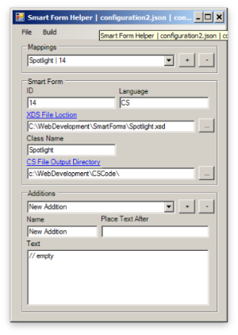

# Smart Form Helper

Helps generate c# from an Ektron smart form xsd. This is useful when you have a widget that is dependant on a smart form. This app is as is and will never be updated. In fact, may your god have mercy on you if you have Ektron (or any of it's incarnations) as your cms. There are plent of real cms' out there are free and
superior.

One item to note, make sure you know where the xsd.exe executable is.

